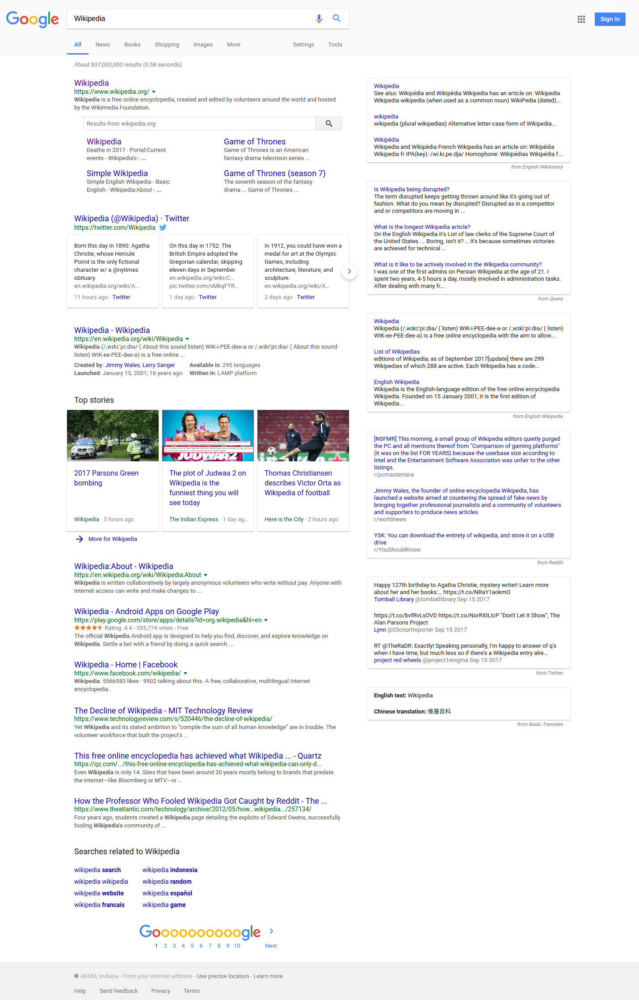

#  Right-hand Side

Right-hand Side is a Chrome extension that integrates contents from different sources (e.g. Wikipedia, Wolfram Alpha, Twitter) into Google search results.

All the contents are located at the right-hand side of the Google results page (that's where the extension name comes from), and have the same UI as Google's own [Knowledge Graph](https://en.wikipedia.org/wiki/Knowledge_Graph) results to create a unified and consistent user experience.

## Usage
It's quite simple! Just google any keyword as you normally would, and the results will appear at the right-hand side.

Below is an example:

## Sources
Currently, the extension supports the following sources, and you are able to select the ones you like from these sources in the extension options page.

| source | description |
| ------ | ----------- |
| [Wikipedia](https://www.wikipedia.org/) | free online encyclopedia |
| [Wolfram Alpha](https://www.wolframalpha.com/) | computational knowledge engine |
| [Twitter](https://twitter.com/) | micro-blogging Internet service |
| [Reddit](https://www.reddit.com/) | social news website |
| [Wiktionary](https://www.wiktionary.org/) | free online multilingual dictionary |
| [Wikisource](https://wikisource.org/) | free online digital library |
| [Quora](https://www.quora.com/) | question-and-answer website |
| [Zhihu](https://www.zhihu.com/) (知乎) | Chinese question-and-answer website |
| [iCiba](https://www.iciba.com/) (爱词霸) | online Chinese-English/English-Chinese dictionary |
| [Bing Dictionary](https://cn.bing.com/dict/) | online Chinese-English/English-Chinese dictionary |
| [Baidu Translate](https://fanyi.baidu.com/) (百度翻译) | multilingual machine translation service |
| [Moedit](https://www.moedict.tw/) (萌典) | online Chinese dictionary |
| [Wechat Public Platform](https://mp.weixin.qq.com/) (微信公众平台) | social marketing platform |
| [NetSpeak](http://www.netspeak.org/)  | English language usage search engine |
| [Daizhige](http://www.daizhige.org/) (殆知阁) | Classical Chinese digital library |
